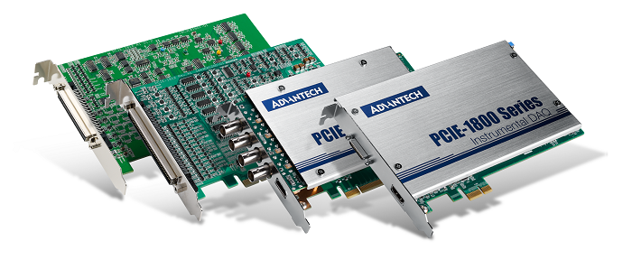

# Matlab Advantech Examples

Matlab examples to use Advantech DAQ cards for data acquisition systems :

- Analog/Digital Input
- Analog/Digital Output
- Counter

---

## Data acquisition

Data acquisition is the process of sampling signals that measure real world physical conditions and converting the resulting samples into digital numeric values that can be manipulated by a computer. Data acquisition systems, abbreviated by the initialisms DAS, DAQ, or DAU, typically convert analog waveforms into digital values for processing. The components of data acquisition systems include:

- Sensors, to convert physical parameters to electrical signals.
- Signal conditioning circuitry, to convert sensor signals into a form that can be converted to digital values.
- Analog-to-digital converters, to convert conditioned sensor signals to digital values.

## DAQ hardware

DAQ hardware is what usually interfaces between the signal and a PC. It could be in the form of modules that can be connected to the computer's ports (parallel, serial, USB, etc.) or cards connected to slots (S-100 bus, AppleBus, ISA, MCA, PCI, PCI-E, etc.) in a PC motherboard or in a modular crate (CAMAC, NIM, VME). Sometimes adapters are needed, in which case an external breakout box can be used.

DAQ cards often contain multiple components (multiplexer, ADC, DAC, TTL-IO, high speed timers, RAM). These are accessible via a bus by a microcontroller, which can run small programs. A controller is more flexible than a hard wired logic, yet cheaper than a CPU so that it is permissible to block it with simple polling loops. For example: Waiting for a trigger, starting the ADC, looking up the time, waiting for the ADC to finish, move value to RAM, switch multiplexer, get TTL input, let DAC proceed with voltage ramp. 